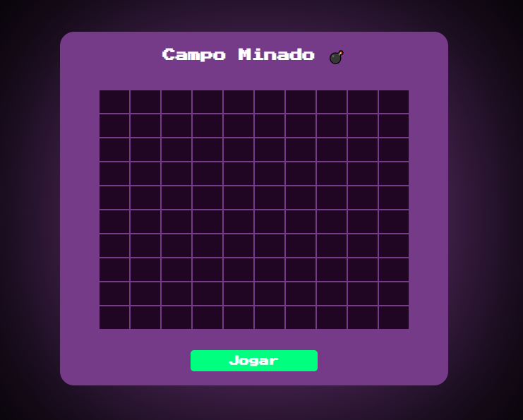
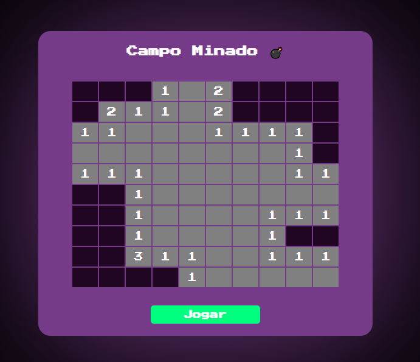
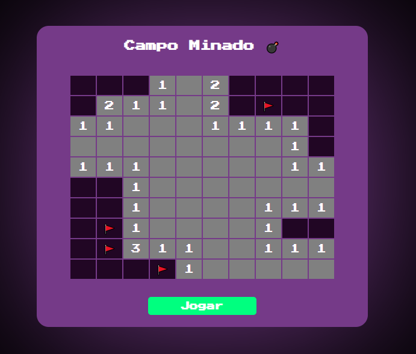
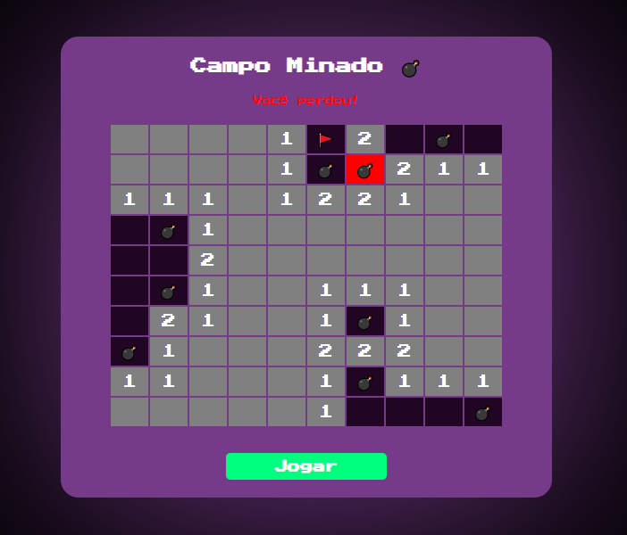
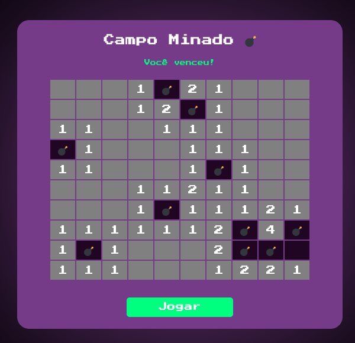

# Campo Minado

**Disciplina**: FGA0210 - PARADIGMAS DE PROGRAMAÇÃO - T01 <br>
**Número do Grupo**: 04<br>
**Paradigma**: Lógico<br>

## Alunos
| Foto | Matrícula | Nome | GitHub |
|:--:|:--:|:--:|:--:|
| | 15/0005563 | Andre Lucas Ferreira Lemos de Souza | [@andrelucasf](https://github.com/andrelucasf) 
| | 18/0030272 | Antonio Ruan Moura Barreto | [@RuanMoura](https://github.com/RuanMoura) 
| | 18/0041444 | Brenda Vitória dos Santos | [@brendavsantos](https://github.com/brendavsantos)
| | 18/0052616 | Estevão de Jesus Reis | [@estevaoreis25](https://github.com/estevaoreis25)
| | 18/0033743 | Joao Pedro Silva de Carvalho | [@jps12](https://github.com/jps12) 
| | 18/0037439 | Sérgio de Almeida Cipriano Junior | [@sergiosacj](https://github.com/sergiosacj) 
| | 18/0028324 | Thiago Luiz de Souza Gomes| [@thiagomesUNB](https://github.com/thiagomesUNB) 
| | 18/0028685 | Victor Samuel dos Santos Lucas| [@victordsantoss](https://github.com/victordsantoss) 
| | 17/0115500 | Vinicius Vieira de Souza | [@faco400](https://github.com/faco400) 

## Sobre 
O projeto do paradigma lógico visa desenvolver uma aplicação do jogo campo minado (com todas as regras e peculiaridades) utilizando Prolog. 

## Screenshots









## Instalação 
**Linguagens**: Prolog<br>
**Tecnologias**: SWI-Prolog version 8.5.5 for x86_64-linux e HTML<br>
**Requisitos**: Docker e Docker Compose<br>
**Execução**: Na raíz do projeto execute 
```
docker compose up
```
## Uso 
O jogo consiste em um pequeno conjunto de regras:  
1 - Se você descobrir uma mina, perde e o jogo é finalizado.  
2 - Se descobrir um quadrado vazio, o jogo continua.  
3 - Se aparecer um número, ele informará quantas minas estão escondidas nos oito quadrados que o cercam. Você pode usar essa informação para deduzir em que quadrados próximos é seguro clicar.   
**Bônus**: Clicando com o botão direito você pode marcar com uma bandeira onde suspeita que pode haver minas.  

## Vídeo
Adicione 1 ou mais vídeos com a execução do projeto.

## Fontes
* https://github.com/vband/Campo-Minado 
* https://github.com/lohhans/MinesweeperProlog
* https://buslogic.pro/content/docker
* https://github.com/Anniepoo/swiplwebtut/
* https://us.swi-prolog.org/pldoc/doc/home/jan/lib/swipl/library/http/http_json.pl
* https://github.com/danieldebiasi/campo-minado
* https://codepen.io/larii_d/pen/eEbJyZ 
